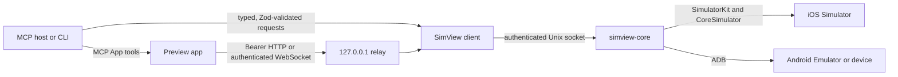

# Architecture

SimView is a local-only bridge between an MCP host (or the CLI), an embedded
browser preview, and an available iOS Simulator or Android ADB target. The
TypeScript side owns public contracts and orchestration; the Swift side owns
platform backends and the high-throughput capture/input path.

## Components and ownership

- `packages/contracts` owns browser-safe Zod schemas, inferred public types,
  method names, protocol limits, relay payloads, annotation data, and the
  authoritative protocol/version constants consumed by TypeScript.
- `packages/client` owns the length-prefixed Unix-socket framing, method-keyed
  requests, request correlation, deadlines/cancellation, inbound/outbound
  validation, partial-write handling, ephemeral process lifecycle, and the
  shared per-device daemon registry.
- `packages/core` resolves the packaged `simview-core` binary before local
  SwiftPM build output. Release scripts verify that the packaged binary is
  fresh and arm64-native.
- `packages/mcp` owns MCP tool registration and output schemas, one MCP stdio
  session, per-review resource metadata, in-memory annotations, preview
  buffering, and the authenticated loopback relay. It does not persist
  device UI contents or own native compatibility code.
- `packages/app` owns the embedded/browser preview, H.264/MJPEG fallback,
  pointer/keyboard interaction, annotations UI, and bridge result routing. It
  does not start native processes or write review state to disk.
- `packages/cli` owns strict command parsing, human/JSON output, and short-lived
  client commands. `preview` keeps one session open until an explicit signal.
- `native/SimViewCore` owns provider selection, iOS SimulatorKit/CoreSimulator,
  Android ADB orchestration, capture/encoding, input, accessibility, diagnostics,
  and the authenticated Unix socket server. Platform assumptions stay behind
  `DeviceProvider` and `DeviceBackend` boundaries.
- `native/SimViewAndroid` owns the transient API-26+ Android agent. It is pushed
  under `/data/local/tmp`, started with `app_process`, authenticated before use,
  and removed when the backend shuts down.

## Process and trust flow

The native token is supplied through a launch-time file descriptor and is not
placed in the process list. The standalone browser relay has a separate random
token. HTTP requests use `Authorization: Bearer`; WebSockets authenticate in
their first message and are rejected after a short handshake deadline.
Capability tokens must never be logged or returned in ordinary MCP structured
state. The CLI only prints a browser URL when the caller explicitly requests `--no-open` or
`--print-url`.

The process model has two layers:

- Each live MCP task has one lightweight stdio bridge. Its `SimViewSession`
  owns a relay, review ID, preview buffers, and annotation maps, and closes all
  of them when the bridge ends. Its MCP App resource is
  `ui://simview/<version>/reviews/<reviewId>/preview.html`; the UUID identifies
  the review and is not a capability secret.
- `open_simview` is the only model-visible tool associated with that UI
  resource. Model-side discovery, connection, screenshot, accessibility, and
  annotation tools explicitly omit a resource URI so their results cannot
  instantiate or replace the preview. The mounted app uses resource-scoped,
  app-only aliases for its internal device and inspection calls.
- Embedded video uses bounded, sequenced `get_preview_packets` responses over
  the host bridge. Full React Native or native accessibility output is
  validated and
  serialized once, split into bounded UTF-8 byte chunks, and reassembled and
  validated in the app. Tree capture runs only when Inspector or Annotate is
  opened or Inspector is explicitly refreshed. Inspector transfers temporarily
  pause video polling, while Annotate already holds a frozen frame; with both
  surfaces closed, the bridge performs no background tree refresh. This is the
  primary embedded transport because
  Codex cannot open insecure localhost HTTP/WebSocket origins and a local TLS
  certificate would impose user setup. A second MCP resource would still use
  the same host bridge rather than creating a separate network lane.
- `connect_device` is headless. The native observation coordinator retains the
  newest framebuffer, a 64×64 luma signature, independent frame/image
  revisions, and one 1024-long-edge JPEG in memory. H.264/MJPEG encoding and
  MCP packet retention start only when a preview subscribes. Warm frames are
  cleared on device changes, disconnect, shutdown, and idle expiry and are
  never written to disk.
- `observe_screen` returns bounded semantic nodes initially and deterministic
  SHA-256 deltas thereafter. Neither `semantic` nor `auto` waits for or returns
  an image; only explicit `visual` mode requests the prepared JPEG.
  `search_elements` ranks bounded current-snapshot matches across accessible
  names, identifiers, values, roles, placeholders, and React Native metadata;
  its winning generation-scoped ref can be passed to `tap_element`.
  `perform_actions` combines up to 20 ordered inputs, post-action settling, and
  one semantic observation in a single MCP round trip by default.
- Element inspection first captures the native accessibility snapshot as a
  safe fallback,
  then optionally discovers loopback Metro targets through `metro-bridge`. A
  target must match the selected device by logical device ID, device name,
  or be the sole unambiguous target. React Native inspection returns only a
  bounded visual Fiber projection and whitelisted semantic fields; component
  props, route params, raw Fiber objects, external paths, and dependencies are
  not returned. If Metro MCP owns the older single-client Hermes connection,
  SimView validates and reuses its loopback CDP multiplexer record; newer
  multi-debugger targets connect directly. Any discovery, CDP, measurement, or
  validation failure returns the complete native snapshot with a bounded fallback
  reason instead of a partially merged tree. Every CDP evaluation is
  deadline-bounded so a stale Hermes session cannot leave the preview request
  pending indefinitely. Source paths are reduced relative to an explicit
  `SIMVIEW_PROJECT_ROOT` or the nearest package root inferred from symbolicated
  app sources; absolute paths and dependency sources are never returned.
- **Send to Chat** persists the frozen frame and each annotation crop under a
  newly created mode-0700 directory in the system temporary directory. PNG
  files use mode 0600, only generated filenames are accepted, and the handoff
  exposes their absolute paths as text. The session tracks and removes every
  directory it creates when its MCP bridge closes.
- `SimViewClient.acquire({ deviceId, codec })` shares one detached native backend
  per platform-qualified native identifier and compatible
  protocol/version/binary identity. `udid` remains an iOS compatibility alias.
  The
  backend record lives under `${tmpdir()}/simview-daemons/<uid>/<instanceId>`;
  directories are mode 0700, records and sockets are mode 0600, and the token
  is never returned by status or logged. Atomic startup locks ensure concurrent
  tasks cannot create duplicate compatible backends.

The backend stops capture, clears pending frames, and stops encoders when its
last authenticated client disconnects. It remains available for a five-minute
reconnect window, then exits. A new packaged native binary gets a different
instance ID from its SHA-256, so it cannot attach to an incompatible old
backend. `SimViewClient.start()` remains the explicit ephemeral/test path, and
`SIMVIEW_BACKEND_MODE=ephemeral` is the rollback switch.

The client package exports registry status, stop, and prune helpers for
diagnostics. The top-level CLI exposes them as `simview daemon status`,
`simview daemon stop --device-id <id>` (or `--all`), and `simview daemon prune`.
These commands operate only on trusted registry records and never print backend
capability tokens.

## Contract and validation boundary

Every native method is represented in the protocol-v2 `SimViewMethodMap` in
`packages/contracts/src/protocol.ts`. The client validates parameters before
encoding a request and validates the selected result schema after decoding a
response. MCP tools expose `outputSchema` and parse structured results before
returning them. Browser relay input, relay authentication, annotations, unified
element and screen context, accessibility selectors, probe status/target, and
recursive JSON values have dedicated schemas.

Swift mirrors the wire protocol with explicit `Codable` request/result handling
and a recursive JSON representation. Shared fixtures under `tests/fixtures`
are the compatibility anchor for Bun and XCTest. Unknown methods, malformed
frames, unsupported protocol versions, oversized payloads, empty accessibility
selectors, and invalid normalized coordinates are rejected at the boundary.

Public device descriptors use opaque namespaced IDs, normalized
platform/kind/state fields, availability, and explicit per-device capabilities.
iOS UDIDs and Android ADB serials remain diagnostic and compatibility fields,
not cross-platform identity keys.

## Native lifecycle and backpressure

The native server authenticates clients before accepting requests, times out
unauthenticated sockets, and tracks authenticated connections for idle shutdown
(ephemeral clients may also provide a parent PID). Capture, observation image
work, semantics, and input use independent bounded queues. Newest-frame-wins
settling prevents capture work from delaying input. H.264 encoding runs asynchronously;
MJPEG work runs off the server queue. Each connection prioritizes control
responses and coalesces preview frames so a slow viewer cannot accumulate an
unbounded video backlog. `health.get` reports the sanitized PID, instance ID,
configured device identity, codec client counts, capture state, and idle deadline.
The TypeScript client likewise keeps a bounded request-write queue and handles
fragmented/coalesced frames without copying a complete receive buffer for every
chunk.

## Preview invariants

H.264 is preferred and MJPEG is the compatibility fallback. Native capture
reuses pixel buffers, coalesces pending encodes, sends codec configuration and
keyframes for recovery, and keeps HID work off the capture queue. The app paints
at most once per animation frame, keeps canvas dimensions stable, throttles
framework state, bounds packet history, and resets cached frame state when the
stream stops. Changes must preserve these invariants and pass the latency
acceptance test in `docs/compatibility.md`.

## Compatibility boundary

SimulatorKit and Indigo APIs are private and may change between Xcode releases.
All selector and ABI knowledge stays under `native/SimViewCore/Sources/SimViewCore/Compatibility`;
higher layers use stable SimView services. The optional UIKit probe is read-only,
explicitly enabled for one non-Apple bundle, and accessibility remains usable
without it. Do not move private symbols into TypeScript contracts or public
documentation.

Android discovery shares the user's existing loopback ADB server. SimView never
kills it, changes authorization keys, pairs devices, or enables legacy TCP mode.
Every target operation passes `-s <serial>` as a process argument without a
shell. Agent socket mappings and temporary files are random, authenticated, and
cleaned up only when SimView created them. If the agent cannot start, the backend
falls back to throttled ADB PNG capture, host-side H.264 encoding, and discrete
shell input. Continuous raw touch remains agent-only, and Android text support
is currently declared as ASCII rather than Unicode.

## Packaged binary resolution and release safety

`@simview/core` resolves `packages/core/bin/simview-core` before local SwiftPM
release output. After native or protocol changes, run `bun run release:build`
before packaging or plugin testing so the compiled artifacts cannot be stale.
The release build produces arm64 binaries, permission-safe
archives, SHA-256 checksums, `release-manifest.json`, and a CycloneDX SBOM.
Binary publication remains blocked until the licensing, Developer ID signing,
notarization, and real-target gates in `docs/binary-redistribution.md` and
`docs/compatibility.md` have been reviewed.
