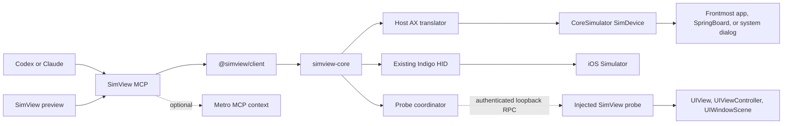

# SimView accessibility navigator and injected UIKit probe

Status: implemented; release-matrix gates remain  
Prepared: 2026-07-29  
Implemented: 2026-07-29  
Target repository: `/Users/stephenradford/Documents/SimView`

Implementation evidence:

- Host accessibility returned a 25-node tree from an iOS 26.1 simulator.
- Observation-scoped semantic selection drove a physical Indigo HID tap.
- Native accessibility wait passed against an absent-element predicate.
- The injected probe reported scene, window, controller, hit-tested view class,
  bounded view search, and a bounded hierarchy from a third-party app.
- Bun typecheck/tests, Swift build/tests, the universal probe build, and Codex
  plugin validation passed.

Developer ID signing/notarization, Intel hardware, older supported Xcode lines,
and the extended performance/rotation/typing matrix remain release gates.

## Decision

Build two complementary inspection tiers:

1. **A host-side accessibility navigator enabled by default.** Read the frontmost
   Simulator application's accessibility hierarchy through CoreSimulator and
   macOS `AccessibilityPlatformTranslation`. This requires no AXe installation,
   no IDB installation, no simulator-side daemon, no app modification, and no
   app restart.
2. **An optional injected UIKit probe.** Bundle a small, read-only iOS Simulator
   dynamic library that can report concrete `UIView` classes, hit-tested views,
   owning `UIViewController` instances, windows, and `UIScene` information. It
   is only loaded into an explicitly selected third-party app and requires that
   app to relaunch.

The accessibility tier is the source of truth for agent navigation. The probe
is enrichment, not a prerequisite. Existing SimulatorKit Indigo HID remains the
default input path, so a selector-driven action still exercises normal hit
testing, gesture recognizers, focus, overlays, and event ordering.

Do not adopt Argent's simulator-side `ax-service` for SimView. Current IDB
demonstrates a cleaner host-side accessibility path using the `SimDevice`
object SimView already owns. Do not copy or redistribute Argent's bundled
`ax-service`, `simulator-server`, or injection dylibs; those artifacts are
explicitly proprietary. The host accessibility implementation may adapt the
relevant MIT-licensed IDB source with attribution. The injected probe must be
an independent SimView implementation using UIKit APIs.

## Outcome

An agent should be able to use SimView in a Browser/Playwright-like loop:

```text
observe screen and accessible elements
  -> choose a stable element reference or semantic selector
  -> perform a physical HID action
  -> wait for an accessible state
  -> observe again
```

A human should be able to freeze the current frame, browse or search its
accessibility hierarchy in a transient overlay, select an element to highlight
it, and leave the existing point comment. The saved in-memory annotation gains
semantic context without adding a review sidebar or durable review files.

When the probe is available, the same element or point can additionally report:

- concrete `UIView` class and module;
- the view that actually wins `hitTest(_:with:)`;
- nearest owning `UIViewController`;
- visible and presented controller path;
- containing window and key-window status;
- `UISceneSession` identifier, role, configuration, and activation state.

## Research findings

### Host-side accessibility is the correct default

Current IDB obtains Simulator accessibility without installing a service in the
simulator. Its implementation:

- resolves the private CoreSimulator selector
  `sendAccessibilityRequestAsync:completionQueue:completionHandler:`;
- loads macOS `AccessibilityPlatformTranslation`;
- asks `AXPTranslator` for the frontmost application or the element at a point;
- bridges lazy accessibility attribute requests back to the selected
  `SimDevice`;
- serializes nested or flat trees;
- searches elements by label, identifier, value, title, role, role
  description, subrole, help, or placeholder.

The available fields include label, frame, value, unique identifier, type,
title, help, enabled state, custom actions, role, role description, subrole,
required-content state, pid, traits, expanded state, placeholder, hidden state,
focus state, and remote-process status.

This path can describe the frontmost application, SpringBoard, and system
dialogs. It therefore remains useful when the app is not owned by the user or
cannot be injected.

### Accessibility does not provide the complete UIKit object graph

An accessibility element is a semantic object. It may be backed by a `UIView`,
a `UIAccessibilityElement`, a framework bridge, or remote content. Its role or
type is not a reliable concrete UIKit class, and the cross-process hierarchy
does not expose the owning `UIViewController` or `UIScene`.

Accessibility alone can provide excellent agent selectors, bounds, state, and
labels. It cannot truthfully promise:

- the concrete `UIView` subclass receiving the touch;
- the responder-chain owner;
- a navigation, tab, split, or presented controller path;
- scene session/configuration metadata;
- source-level SwiftUI view names.

### An injected probe is justified for rich app internals

Argent's current architecture independently validates this split: it uses an
accessibility service for general screen description and a separately injected
native-devtools dylib for a full UIKit hierarchy and concrete view fields.
Argent's public tool layer exposes view class, geometry, identifiers, labels,
interaction state, transforms, content mode, colors, and layer class. Its
current public result contract does not expose a complete controller hierarchy,
so controller and detailed scene context are a SimView-specific addition.

The probe can use public UIKit object inspection after it is inside the target
process. The injection mechanism remains a development-only Simulator
technique. Apple platform binaries, hardened apps, and apps with library
validation may reject it.

### Why not WebDriverAgent

WebDriverAgent is valuable for physical devices and XCTest-backed automation,
but it is unnecessary overhead for this Simulator feature. It adds a runner,
session lifecycle, and signing boundary while still not replacing the value of
a targeted in-process controller/scene probe. Keep WDA for the separate
physical-device roadmap.

## Product boundaries

### Included

- Frontmost-app accessibility snapshots.
- Nested and flat tree formats.
- Compact, token-efficient text serialization for agents.
- Structured JSON for MCP Apps and programmatic clients.
- Search by stable semantic attributes.
- Point inspection and element highlighting.
- Generation-scoped element references.
- Physical `tap_element` actions through existing Indigo HID.
- Accessibility-state waits.
- Frozen-frame accessibility browsing and annotation enrichment.
- Optional, self-contained UIKit probe for third-party Simulator apps.
- View class, hit-test result, controller, window, and scene context.
- Optional Metro MCP enrichment for React Native route/component/source data.

### Not included

- AXe, IDB, Appium, or WebDriverAgent as runtime dependencies.
- Accessibility-based input as the normal action path.
- Injection into Apple `com.apple.*` applications.
- Injection into an app without an explicit bundle identifier and relaunch.
- App Store or physical-device injection.
- Source-level SwiftUI hierarchy.
- Durable test recording or review persistence.
- A permanent tree sidebar.

## Architecture



## Repository changes

```text
native/
├── SimViewCore/
│   └── Sources/SimViewCore/
│       ├── Accessibility/
│       │   ├── AccessibilityService.swift
│       │   ├── AccessibilitySnapshot.swift
│       │   ├── AccessibilityQuery.swift
│       │   ├── AccessibilitySerializer.swift
│       │   ├── AccessibilityReferenceStore.swift
│       │   └── CoordinateTransformer.swift
│       ├── Compatibility/
│       │   ├── AccessibilityFrameworks.swift
│       │   └── AccessibilityPrivateInterfaces.swift
│       └── Probe/
│           ├── ProbeCoordinator.swift
│           ├── ProbeLauncher.swift
│           └── ProbeProtocol.swift
├── SimViewAXShim/
│   ├── include/
│   └── src/
└── SimViewProbe/
    ├── SimViewProbe.xcodeproj
    ├── SimViewProbe/
    │   ├── Bootstrap.m
    │   ├── ProbeClient.m
    │   ├── ViewInspector.m
    │   ├── ControllerInspector.m
    │   └── SceneInspector.m
    └── Config/

packages/
├── client/src/accessibility.ts
├── mcp/src/accessibility-tools.ts
├── mcp/src/compact-tree.ts
└── app/src/
    ├── accessibility.ts
    └── components/ElementNavigator.tsx
```

Use a separate Clang/Objective-C shim target for the minimum private
AccessibilityPlatformTranslation declarations needed by the macOS core. Load
the private framework dynamically and capability-probe selectors at runtime;
do not create a hard launch-time dependency that makes all of SimView fail when
the accessibility path changes.

Build `SimViewProbe` as a small Objective-C iOS Simulator dylib for arm64 and,
while Intel support remains a release target, x86_64. Package it beside
`simview-core`; never download it during installation or first use.

## Host accessibility implementation

### Framework and capability loading

Add an accessibility compatibility module that:

1. Locates and `dlopen`s CoreSimulator plus
   `/System/Library/PrivateFrameworks/AccessibilityPlatformTranslation.framework`.
2. Resolves `AXPTranslator` and the required platform-element selectors.
3. Verifies that the selected `SimDevice` responds to
   `sendAccessibilityRequestAsync:completionQueue:completionHandler:`.
4. Reports an independent `accessibility` capability in `doctor`, `hello`, and
   `health.get`.
5. Fails accessibility calls with a structured compatibility error without
   affecting video, screenshots, or HID.

Keep all private selectors and ABI declarations under `Compatibility`.

### Translation lifecycle

Adapt the minimal IDB translation flow:

1. Create one process-wide translator/dispatcher.
2. Allocate a random token per accessibility request.
3. Register the token and selected `SimDevice`.
4. Resolve either the frontmost application or an element at a device point.
5. Serve lazy translator attribute requests through the CoreSimulator async
   request method on a non-main queue.
6. Bound every XPC round trip and whole-tree traversal with timeouts.
7. Serialize the result while the token is valid.
8. Pop the token in `defer`, including error and cancellation paths.

Do not carry native translator objects across public protocol calls. Each
snapshot becomes immutable plain data.

### Snapshot model

```ts
type AccessibilitySnapshot = {
  schemaVersion: 1;
  snapshotId: string;
  generation: number;
  capturedAt: string;
  source: "core-simulator-ax";
  device: {
    udid: string;
    orientation: string;
    logicalWidth: number;
    logicalHeight: number;
    pixelWidth?: number;
    pixelHeight?: number;
  };
  root: AccessibilityNode;
  stats: {
    nodeCount: number;
    truncated: boolean;
    durationMs: number;
  };
};

type AccessibilityNode = {
  ref: string;                 // ax:<generation>:<ordinal>
  role?: string;
  roleDescription?: string;
  subrole?: string;
  label?: string;
  value?: string;
  identifier?: string;
  title?: string;
  help?: string;
  placeholder?: string;
  enabled?: boolean;
  hidden?: boolean;
  focused?: boolean;
  expanded?: boolean;
  traits?: string[];
  pid?: number;
  frame?: {
    points: { x: number; y: number; width: number; height: number };
    normalized: { x: number; y: number; width: number; height: number };
  };
  children?: AccessibilityNode[];
};
```

Never expose pointer values as stable IDs. References are valid only for their
snapshot generation. Any action using a reference must re-resolve its semantic
selector against the current tree before input.

### Coordinate model

Accessibility frames, capture pixels, UIKit window coordinates, and normalized
HID coordinates must go through one tested `CoordinateTransformer`.

It must account for:

- logical points versus framebuffer pixels;
- portrait and both landscape orientations;
- display scale;
- non-zero accessibility root origins;
- keyboard, alert, and remote-process overlays;
- preview canvas letterboxing and resize.

The public contract remains normalized `0...1`. Preserve original point frames
in structured data for diagnostics.

### Tree shaping and token efficiency

Do not send the complete raw hierarchy to the model by default.

Support these views:

- `interactive`: visible, enabled or actionable elements plus useful static
  labels; default for agents;
- `visible`: all visible semantic elements;
- `full`: complete nested tree, explicitly requested;
- `point`: the deepest element at one normalized coordinate.

Default compact text:

```text
screen 430x932 snapshot=ax-18
@1 button "Continue" id=continue [0.080,0.820 0.840x0.070] enabled
@2 textfield "Email" id=email [0.080,0.410 0.840x0.060] focused value="person@example.com"
@3 statictext "Welcome back" [0.080,0.210 0.650x0.040]
```

Rules:

- omit absent and default fields;
- round normalized coordinates to three decimals;
- cap depth, node count, text length, and total serialized bytes;
- return truncation metadata and a refinement hint;
- redact secure text values unconditionally;
- keep the complete structured snapshot available to the MCP App without
  duplicating it in model text.

### Search and actions

Selectors may contain:

```ts
type AccessibilitySelector = {
  ref?: string;
  identifier?: string;
  role?: string;
  name?: string;          // accessible label/title
  value?: string;
  exact?: boolean;
  index?: number;         // explicit disambiguation only
  within?: AccessibilitySelector;
};
```

Resolution must:

1. reject stale references unless they can be re-resolved from stored selector
   attributes;
2. require exactly one visible match unless `index` is explicit;
3. reject disabled elements for actions;
4. verify a non-empty, on-screen frame;
5. choose the element's activation/tap point when reliable, otherwise the
   visible frame center;
6. send the existing physical `input.tap`;
7. return transport acknowledgement plus the selector and chosen coordinates,
   not a claim that navigation succeeded.

AXPress, AX scroll, and direct AX value mutation may be added later as explicit
fallback modes. They must not silently replace physical input.

### Waiting

Implement accessibility waits in the native core so the model does not poll at
high frequency through MCP:

- appeared;
- disappeared;
- enabled/disabled;
- focused/unfocused;
- value equals/contains;
- unique match count.

Use a monotonic deadline, cancellation, bounded adaptive polling, and include
the last observed compact state in timeout errors. Do not define a generic
mobile “network idle” condition.

## Injected UIKit probe

### Enablement and launch boundary

The probe is disabled by default.

Enabling it requires:

- one booted Simulator UDID;
- an explicit non-Apple bundle identifier;
- an installed app;
- acknowledgement that the target app will terminate and relaunch.

Prefer per-launch environment injection:

```text
SIMCTL_CHILD_DYLD_INSERT_LIBRARIES=<bundled absolute dylib path>
SIMCTL_CHILD_SIMVIEW_PROBE_PORT=<ephemeral loopback port>
SIMCTL_CHILD_SIMVIEW_PROBE_TOKEN=<random capability token>
xcrun simctl launch --terminate-running-process <udid> <bundle-id>
```

Invoke `xcrun` with an argument array and a controlled environment; never build
a shell command. Do not set global Simulator launchd environment variables.
The library connects back to a loopback-only probe coordinator in
`simview-core`, authenticates with the random token, and then accepts framed
JSON RPC.

Provide two workflows:

- `simview probe enable --bundle-id ...`: managed terminate/relaunch;
- `simview probe env --bundle-id ... --json`: emit exact environment values for
  an external launcher without changing global state.

Reject `com.apple.*` bundle identifiers before relaunch. Detect library
validation/injection failure and keep host accessibility available.

### Probe safety

The probe must:

- be read-only in v1;
- run UIKit traversal on the app's main thread;
- perform transport and JSON work off the main thread;
- enforce per-request timeouts and response-size caps;
- hold UIKit objects only for the duration of a request;
- expose opaque, generation-scoped references rather than pointers;
- avoid method swizzling;
- avoid changing view/controller lifecycle;
- avoid intercepting network, storage, text input, or application callbacks;
- disconnect cleanly without crashing the app when SimView exits.

### Scene and window model

For every connected `UIWindowScene`, report:

```ts
type SceneContext = {
  ref: string;
  persistentIdentifier: string;
  role: string;
  activationState: "unattached" | "foregroundActive" | "foregroundInactive" | "background";
  configurationName?: string;
  delegateClass?: string;
  windows: WindowContext[];
};

type WindowContext = {
  ref: string;
  className: string;
  frame: Rect;
  level: number;
  key: boolean;
  hidden: boolean;
  alpha: number;
  rootController?: ControllerNode;
};
```

Order scenes by activation state and windows by key status/window level. Do not
assume `UIApplication.shared.keyWindow` or a single scene.

### Controller model

```ts
type ControllerNode = {
  ref: string;
  className: string;
  moduleName?: string;
  restorationIdentifier?: string;
  title?: string;
  visible: boolean;
  relationship:
    | "root"
    | "presented"
    | "navigation-stack"
    | "navigation-visible"
    | "tab-child"
    | "tab-selected"
    | "split-child"
    | "child";
  children?: ControllerNode[];
};
```

Traversal rules:

1. Start at every window's `rootViewController`.
2. Record `presentedViewController` before container children when it is
   currently presented.
3. For `UINavigationController`, record the stack and mark the visible
   controller.
4. For `UITabBarController`, record all children and mark the selected
   controller.
5. For `UISplitViewController`, preserve ordered child controllers.
6. Include custom child controllers from `children` without duplicating
   container entries.
7. Detect cycles by object identity during the single request.

The compact default should return only the visible path:

```text
scene main foregroundActive
window UIWindow key
controllers UINavigationController > ProductViewController > CheckoutSheetController (presented)
```

The full tree remains structured and opt-in.

### View and point inspection

`probe.inspectPoint` must:

1. choose the foreground-active scene and topmost eligible window containing
   the point;
2. convert normalized screen coordinates into window coordinates;
3. call `hitTest(_:with: nil)` on the main thread;
4. return the winning view's concrete class, geometry, visibility,
   interaction state, accessibility fields, and containing window;
5. follow `nextResponder` to the nearest `UIViewController`;
6. include the scene and visible-controller path.

`probe.findViews` supports targeted filters:

- exact or prefix class name;
- accessibility identifier;
- accessibility label;
- tag;
- point containment;
- visible/interactable only.

Do not expose an unbounded full view tree to the model. Keep
`probe.fullHierarchy` available to diagnostics and the MCP App with explicit
field, depth, and node limits.

### SwiftUI and React Native limitations

For SwiftUI, the probe will usually resolve a `UIHostingController` and private
hosting view classes. It must label this as UIKit hosting context, not claim a
source-level SwiftUI view.

For React Native, keep Metro MCP as the best source for route, Fiber component,
testID, and source-file information. SimView may merge Metro context with the
same point, but the projects remain independently usable.

## Correlating accessibility and probe data

The two hierarchies do not share a stable object identity. Correlate only for a
single observation using:

1. exact accessibility identifier;
2. normalized frame overlap;
3. label/value agreement;
4. point hit testing at the accessibility activation point.

Return a confidence:

```ts
type ContextMatch = {
  accessibilityRef: string;
  probeViewRef?: string;
  confidence: "exact" | "strong" | "weak" | "none";
  reasons: string[];
};
```

Never present a heuristic match as exact. For an annotation at a point, the
probe's real hit-test result is more useful than guessing a view from the
entire accessibility rectangle.

## Native protocol additions

Keep wire protocol version 1 because framing and request semantics are
unchanged. Add a capability list to `hello`; every new response carries its own
`schemaVersion`.

Add methods:

```text
accessibility.snapshot
accessibility.elementAtPoint
accessibility.find
accessibility.wait
probe.status
probe.enable
probe.disable
probe.context
probe.inspectPoint
probe.findViews
probe.fullHierarchy
```

New stable errors:

```text
ACCESSIBILITY_UNAVAILABLE
ACCESSIBILITY_FRAMEWORK_UNAVAILABLE
ACCESSIBILITY_SELECTOR_UNAVAILABLE
ACCESSIBILITY_REQUEST_TIMEOUT
ACCESSIBILITY_TREE_TOO_LARGE
ACCESSIBILITY_STALE_REFERENCE
ACCESSIBILITY_ELEMENT_NOT_FOUND
ACCESSIBILITY_ELEMENT_AMBIGUOUS
ACCESSIBILITY_ELEMENT_NOT_ACTIONABLE
PROBE_DISABLED
PROBE_RESTART_REQUIRED
PROBE_BUNDLE_NOT_INJECTABLE
PROBE_INJECTION_REJECTED
PROBE_CONNECTION_TIMEOUT
PROBE_PROTOCOL_MISMATCH
PROBE_RESPONSE_TOO_LARGE
```

`doctor --json` must separately report:

```json
{
  "capabilities": {
    "accessibility": {
      "available": true,
      "coreSimulatorSelector": true,
      "translationFramework": true
    },
    "probe": {
      "bundled": true,
      "architectures": ["arm64", "x86_64"],
      "targetBundleId": null,
      "connected": false
    }
  }
}
```

## MCP tools

Add these model-visible tools:

| Tool | Purpose |
| --- | --- |
| `observe_screen` | Return one PNG plus the compact interactive accessibility snapshot and temporal-alignment metadata |
| `get_accessibility_tree` | Return interactive, visible, or full tree without another screenshot |
| `find_elements` | Resolve semantic selectors and return unique refs/bounds |
| `tap_element` | Re-resolve one element and perform a physical HID tap |
| `inspect_point` | Return AX element plus optional view/controller/scene context |
| `wait_for_element` | Wait for a semantic state without model-side polling |
| `get_ui_context` | Return probe status and compact active scene/window/controller path |
| `enable_ui_probe` | Explicitly relaunch one third-party app with the bundled probe |

`observe_screen` should become the default agent entry point. It replaces a
two-call screenshot/tree observation and guarantees both results identify their
timestamps:

```ts
type Observation = {
  frameId: string;
  frameCapturedAt: string;
  snapshotId: string;
  accessibilityCapturedAt: string;
  captureDeltaMs: number;
  context?: {
    scene?: string;
    window?: string;
    controllerPath?: string[];
  };
};
```

No OS API provides an atomic video-frame/accessibility snapshot. Report the
delta rather than claiming atomicity.

Update the SimView skill so agents:

1. prefer `observe_screen`;
2. use identifiers/roles/names over coordinates;
3. use `tap_element` for semantic targets;
4. call `wait_for_element` or observe after each action;
5. fall back to pixel coordinates when AX is unavailable or incomplete;
6. enable the probe only when controller/scene/class information is needed and
   an app relaunch is acceptable.

## Annotation and preview integration

Preserve the existing product shape:

- no sidebar;
- top toolbar;
- point annotations only;
- click, write a comment in a popup, save, popup closes;
- session memory only;
- **Send to Chat** sends the frozen PNG and compact coordinate comments.

Add an **Elements** toolbar control that opens a transient popover or centered
overlay. It contains:

- search;
- compact hierarchical rows;
- role, label, identifier, and enabled/focused state;
- optional class/controller badges when the probe is connected;
- a reveal/highlight action;
- no persistent panel after dismissal.

Interaction rules:

- In **Interact**, selecting an element highlights its bounds; an explicit
  **Tap** action performs `tap_element`.
- Entering **Annotate** freezes the displayed canvas first, then immediately
  captures an accessibility snapshot and records the timestamp delta.
- Selecting an element in **Annotate** positions the annotation dot at its
  activation point and opens the existing comment popup.
- Clicking the frozen frame still creates a dot directly. SimView runs
  `inspect_point` in the background and attaches any returned context.
- Saving a comment must not wait indefinitely for AX or probe enrichment.
- Returning to **Interact** invalidates the frozen snapshot and resumes video.

Extend the in-memory annotation shape:

```ts
type AnnotationContext = {
  capturedAt: string;
  accessibility?: {
    snapshotId: string;
    ref?: string;
    role?: string;
    label?: string;
    identifier?: string;
    frame?: NormalizedRect;
  };
  native?: {
    viewClass?: string;
    controllerClass?: string;
    controllerPath?: string[];
    windowClass?: string;
    sceneIdentifier?: string;
    matchConfidence?: "exact" | "strong" | "weak" | "none";
  };
  metro?: {
    route?: string;
    component?: string;
    testID?: string;
    source?: string;
  };
};
```

The default **Send to Chat** payload remains compact:

```text
1. (0.512, 0.684) "Spacing is wrong"
   button "Continue" id=continue
   UIView: PrimaryButtonView; controller: CheckoutViewController; scene: main
```

Do not include the entire tree unless the user explicitly requests it.

## CLI additions

```text
simview observe [--udid <udid>] [--format text|json]
simview tree [--scope interactive|visible|full] [--format text|json]
simview find --role button --name Continue
simview inspect-point --x 0.5 --y 0.7
simview tap-element --id continue
simview wait --id welcome --state visible --timeout 5000
simview probe status
simview probe enable --bundle-id com.example.app
simview probe disable
simview probe context [--full]
simview probe env --bundle-id com.example.app --json
```

All commands must work through `@simview/client` and the same native protocol;
the CLI must not duplicate CoreSimulator or probe logic.

## Security and privacy

- Keep all sockets loopback-only or in SimView's existing mode-0700 temporary
  directory.
- Generate a separate 256-bit token for each probe launch.
- Do not place tokens in URLs, logs, model output, or diagnostics.
- Validate the bundled dylib path and signature before launch.
- Reject caller-supplied injection library paths.
- Do not persist accessibility trees, view trees, or values.
- Never serialize secure text field contents.
- Cap label/value lengths and total tree sizes.
- Treat labels and values as potentially sensitive model context; only return
  them from explicit observation/inspection tools.
- The probe must not expose arbitrary Objective-C invocation, KVC paths,
  expression evaluation, memory reads, or mutation.
- `enable_ui_probe` must clearly report that it terminates and relaunches the
  app.

## Dependency and licensing policy

No new JavaScript runtime dependency is required. Continue using the locked Bun
workspace and `bun:test`.

For host accessibility:

- adapt only the minimum required IDB files/interfaces;
- retain Meta copyright headers where code is adapted;
- add IDB and the exact source revision to `THIRD_PARTY_NOTICES.md`;
- keep modified files visibly marked;
- add golden tests for the serialized contract rather than importing the whole
  IDB dependency graph.

For the probe:

- implement independently in SimView;
- use UIKit APIs and SimView-owned transport/types;
- do not copy, link, embed, patch, or redistribute Argent proprietary
  binaries;
- use Argent only as architectural evidence that accessibility and injected
  native inspection solve different problems.

The release remains a macOS developer tool using private Apple interfaces. The
compatibility and non-App-Store warning must cover the accessibility translator
and injection path in addition to SimulatorKit.

## Implementation phases

### Phase 0 — feasibility and legal spike

1. Add the IDB MIT attribution and record the exact source revision.
2. Dynamically load AccessibilityPlatformTranslation from the current machine.
3. Use SimView's existing `SimDevice` to retrieve one frontmost application
   tree and one element at a point.
4. Normalize one known control's frame and physically tap it through Indigo HID.
5. Build an ad-hoc-signed arm64 Simulator probe that connects to SimView and
   reports the key window, visible controller path, and hit-tested view class.
6. Confirm the probe is rejected for an Apple app and remains optional.

Exit:

- one host AX snapshot and physical semantic tap pass without AXe, IDB, or app
  injection;
- one user app reports view/controller/scene context after explicit relaunch;
- failure of either inspection tier does not break capture or input.

Stop and revise the architecture if the host accessibility path cannot survive
a signed release build or if per-app probe injection cannot be scoped without
global launchd environment changes.

### Phase 1 — accessibility core

1. Add framework loading, capability probes, dispatcher, timeouts, and errors.
2. Implement immutable snapshots, serializer, coordinate transformer, and
   generation references.
3. Implement interactive/visible/full shaping and compact text.
4. Implement point lookup, search, stale-reference handling, and waits.
5. Add protocol and TypeScript client types.
6. Add unit, golden, cancellation, timeout, and size-limit tests.

Exit: the CLI can observe, search, inspect, wait, and physically tap a semantic
element across native UIKit, SwiftUI hosting, SpringBoard, and a system alert.

### Phase 2 — agent tool surface

1. Add `observe_screen` with PNG plus compact AX context.
2. Add tree, find, tap, point inspection, and wait MCP tools.
3. Add ambiguity and non-actionable diagnostics.
4. Update the SimView skill with the semantic action loop.
5. Add an agent fixture that navigates a multi-screen flow without pixel
   coordinate inference when accessibility identifiers are present.

Exit: an agent can navigate a representative flow using semantic selectors,
physical input, and observable waits.

### Phase 3 — frozen-frame navigator and annotations

1. Add the transient **Elements** overlay.
2. Highlight selected element frames on the canvas.
3. Capture AX immediately after entering Annotate and show capture delta.
4. Attach point/element context to in-memory annotations.
5. Include compact context in **Send to Chat** without sending the full tree.
6. Verify direct click-comment-save behavior remains unchanged.

Exit: a human can freeze, search, highlight, comment, save, and send the exact
annotated frame without a sidebar or review file.

### Phase 4 — injected UIKit probe

1. Add the Objective-C Simulator dylib and universal release build.
2. Add authenticated probe coordinator and framed RPC.
3. Add managed per-app relaunch and external-launch environment output.
4. Implement scene/window/controller snapshots.
5. Implement hit-test point inspection and targeted view search.
6. Add probe status, context, and enable MCP/CLI tools.
7. Add injection rejection, crash, disconnect, and timeout handling.

Exit: an explicitly relaunched third-party app reports reliable UIKit
class/controller/scene context while ordinary accessibility remains available
before, during, and after the probe session.

### Phase 5 — correlation and optional Metro enrichment

1. Correlate AX nodes and probe views with explicit confidence.
2. Merge hit-tested probe context into point annotations.
3. Add optional Metro route/component/testID/source enrichment.
4. Preserve provenance for every field: `accessibility`, `probe`, or `metro`.
5. Ensure missing Metro or probe capability never blocks the navigator.

Exit: agent observations and comments can identify semantic element, UIKit
owner, active scene/controller, and React Native component when each source is
available.

### Phase 6 — compatibility and release

1. Extend `doctor`, compatibility docs, SBOM, and notices.
2. Package the probe dylib in Codex, Claude, MCPB, npm, and release archives.
3. Sign and notarize the final artifacts.
4. Run the Xcode/macOS/architecture matrix on real simulators.
5. Benchmark tree latency, output size, app-main-thread impact, video latency,
   and HID action accuracy.
6. Validate clean offline installation with no auxiliary tools.

Exit: the shipped plugin contains every required executable artifact and
degrades by capability rather than failing as a whole.

## Verification matrix

### Fixtures

- UIKit app with navigation, tabs, split view, child controllers, and modal
  presentation.
- UIKit app with multiple scenes and windows.
- SwiftUI app hosted in UIKit.
- React Native Paper and Fabric fixtures with optional Metro context.
- Native controls, custom accessibility containers, web view, alert, keyboard,
  and system permission dialog.
- SpringBoard and one Apple system app for accessibility-only validation.

### Functional

- Frontmost nested and flat trees.
- Interactive-tree pruning.
- Label, identifier, role, value, and scoped queries.
- Unique, missing, and ambiguous matches.
- Point inspection at edges and overlapping views.
- Physical tap after semantic resolution.
- Wait appeared/disappeared/enabled/value.
- Portrait and both landscape orientations.
- Frame/canvas mapping after resize and letterboxing.
- Stale reference after navigation.
- Secure text redaction.
- Tree truncation and refinement.
- Probe enable, restart, connect, disable, and reconnect.
- Apple/hardened app probe rejection with AX fallback.
- Navigation/tab/split/presented controller paths.
- Active/background scene reporting.
- Probe crash without app or SimView crash.
- Annotation context on an exact frozen frame.

### Performance

Measure rather than assume thresholds during the spike, then gate releases on:

- interactive AX snapshot p50/p95 by node count;
- full-tree traversal time and XPC call count;
- `inspect_point` latency;
- probe context and hit-test latency on the app main thread;
- compact output bytes/tokens;
- no material regression to video delivered fps or frame-to-canvas latency;
- no retained UIKit objects or unbounded reference-store growth.

Initial targets on a current Apple Silicon Mac:

- interactive tree p95 under 500 ms for a 500-node fixture;
- point inspection p95 under 150 ms;
- probe hit-test/context p95 under 100 ms;
- default compact model text under 24 KiB;
- no more than 5% reduction in delivered video fps while idle between
  inspection calls.

## Acceptance criteria

- SimView exposes a useful accessibility tree with no separate installation or
  app injection.
- System dialogs and Apple apps remain navigable through accessibility when the
  probe is unavailable.
- Element actions resolve current state and use physical HID by default.
- Agent responses distinguish transport acknowledgement from application
  outcome.
- Stale or ambiguous element references fail explicitly.
- The preview has no persistent sidebar.
- Annotate freezes the exact canvas before capturing semantic context.
- A comment remains a dot plus popup and closes on save.
- **Send to Chat** sends the frozen PNG and compact annotation/context text.
- The optional probe reports concrete view, hit-test, controller, window, and
  scene information for an injectable fixture app.
- Enabling the probe is explicit and reports the relaunch.
- Probe failure never disables accessibility, video, screenshot, or HID.
- SwiftUI and React Native context is labeled honestly.
- No secure text value is emitted.
- No AXe, IDB, WDA, Appium, Homebrew, Node, or end-user Bun installation is
  required.
- Plugin/npm archives contain and sign every required binary and dylib.
- Third-party notices include adapted IDB MIT sources and exclude Argent
  proprietary components.

## Risks and mitigations

| Risk | Mitigation |
| --- | --- |
| CoreSimulator accessibility/private translator changes | Dynamic loading, isolated compatibility module, capability probes, Xcode matrix, screenshot fallback |
| Accessibility tree is incomplete | Point lookup, remote-content handling, visual fallback, optional probe |
| AX frame and video frame drift | Capture timestamps/delta, one coordinate transformer, invalidate on orientation/navigation |
| Stale element references cause wrong taps | Generation-scoped refs, semantic re-resolution, uniqueness and bounds checks |
| Large trees consume excessive tokens | Interactive default, compact text, caps, explicit refinement/full-tree request |
| Probe changes app behavior | Read-only implementation, no swizzling, explicit relaunch, main-thread budget, probe-off regression runs |
| Injection is blocked | Capability/error report and full host accessibility fallback |
| Global injection affects unrelated apps | Per-launch `SIMCTL_CHILD_*` environment only; never set global launchd state |
| Multiple scenes make ownership ambiguous | Report every scene/window, mark active/key choices, include selection reasoning |
| SwiftUI internals are misleading | Report hosting controller/view only and label limitation |
| React Native UIKit classes lack source context | Optional Metro MCP enrichment with provenance |
| Accessibility values expose secrets | Unconditional secure-entry redaction, no persistence, explicit observation calls |
| Licensing contamination from inspected Argent binaries | No copying or redistribution; implement probe independently; adapt only MIT IDB source |

## Primary references

- IDB host accessibility facade:
  https://github.com/facebook/idb/blob/532ac34716dcd20d4c717ffaaaf2c5afa84b0817/FBSimulatorControl/Commands/FBSimulatorAccessibilityCommands.swift
- IDB CoreSimulator/translator dispatcher:
  https://github.com/facebook/idb/blob/532ac34716dcd20d4c717ffaaaf2c5afa84b0817/FBSimulatorControl/Commands/FBAXTranslationDispatcher.swift
- IDB translation request:
  https://github.com/facebook/idb/blob/532ac34716dcd20d4c717ffaaaf2c5afa84b0817/FBSimulatorControl/Commands/FBAXTranslationRequest.swift
- IDB accessibility serializer:
  https://github.com/facebook/idb/blob/532ac34716dcd20d4c717ffaaaf2c5afa84b0817/FBSimulatorControl/Commands/FBSimulatorAccessibilitySerializer.swift
- IDB accessibility keys:
  https://github.com/facebook/idb/blob/532ac34716dcd20d4c717ffaaaf2c5afa84b0817/FBControlCore/Commands/FBAccessibilityKeys.swift
- Argent accessibility/native fallback orchestration:
  https://github.com/software-mansion/argent/blob/7189333ac428a52febe82e5fee87c493ca4dc22b/packages/tool-server/src/tools/describe/platforms/ios/index.ts
- Argent public native hierarchy tool contract:
  https://github.com/software-mansion/argent/blob/7189333ac428a52febe82e5fee87c493ca4dc22b/packages/tool-server/src/tools/native-devtools/native-full-hierarchy.ts
- Apple accessibility containers:
  https://developer.apple.com/documentation/uikit/uiaccessibilitycontainer
- Apple view controllers:
  https://developer.apple.com/documentation/uikit/uiviewcontroller
- Apple scenes:
  https://developer.apple.com/documentation/uikit/scenes
- Apple windows and screens:
  https://developer.apple.com/documentation/uikit/windows-and-screens
